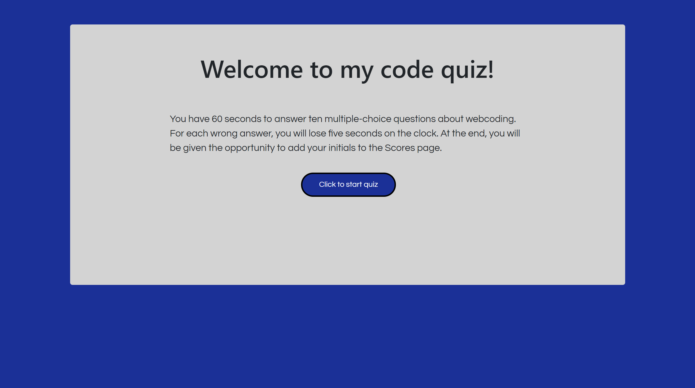
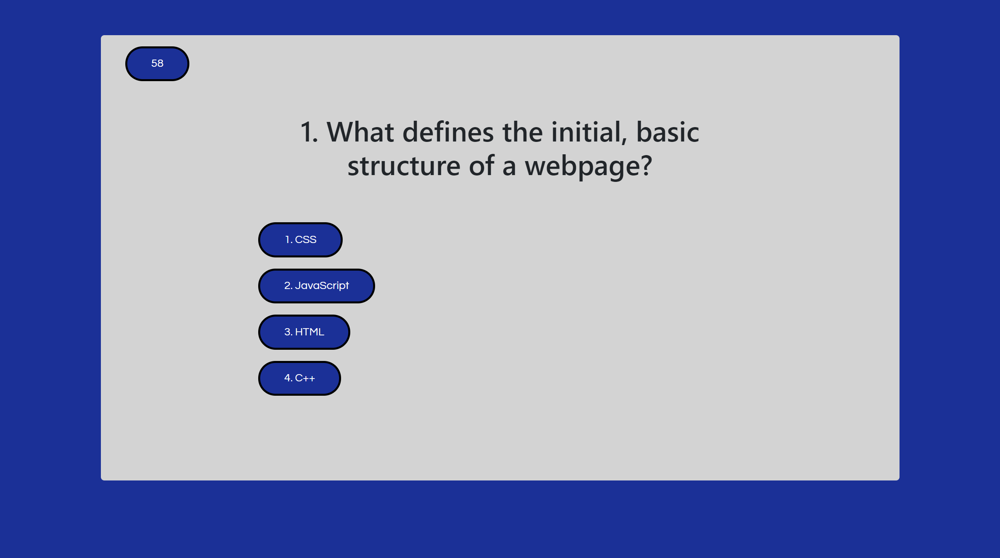
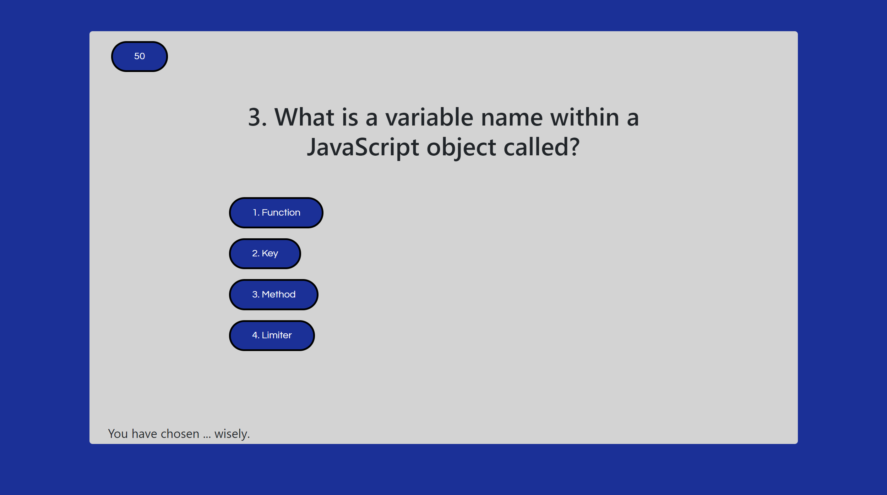
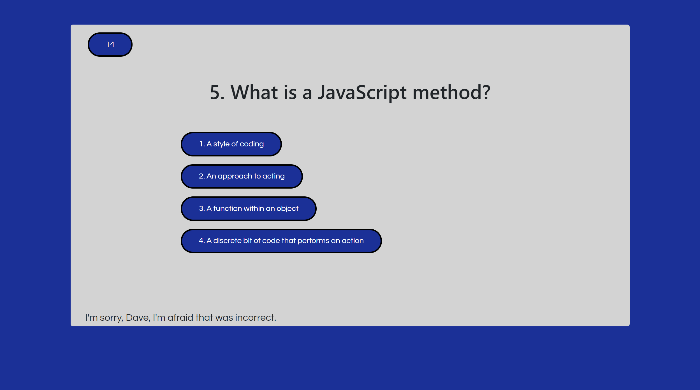
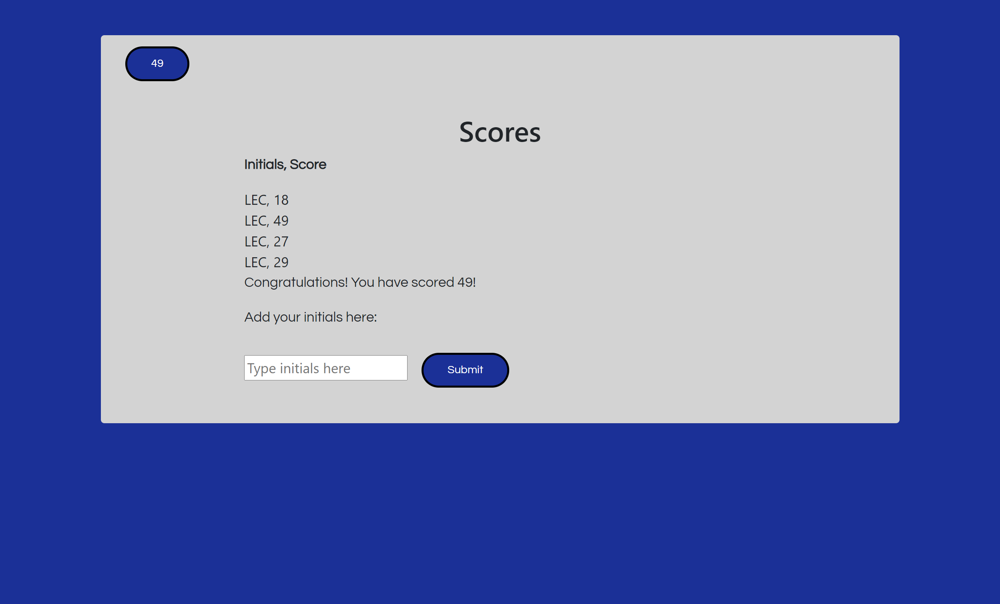
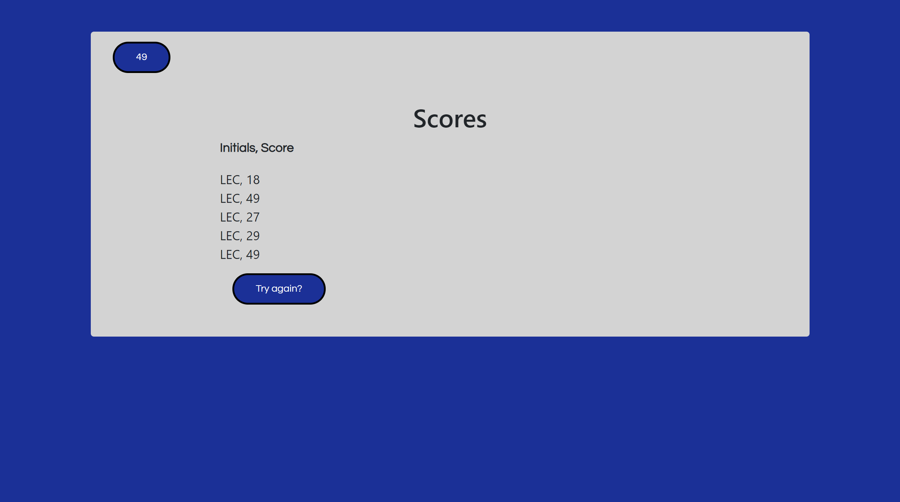

# JavaScript Code Quiz

## Table of Contents

* [Description](#description)
* [Links](#links)
* [Screenshots](#screenshots)
* [Installation Instructions](#installation-instructions)
* [Usage](#usage)
* [Technologies Used](#technologies-used)
* [Tests](#tests)
* [Credits](#credits)
* [Contributing](#contributing)
* [Questions](#questions)
* [Badges](#badges)

## Description

This is a timed, interactive multiple-choice quiz on webcoding, built using JavaScript. It includes a time penalty for incorrect answers and a Scores page. Users should click the "Click to start quiz" button to begin, and click on each of their selected answers. When the quiz is over, the user may save their initials and score to local storage.

## Links

[Javascript quiz site](https://lauracole1900.github.io/javaScriptCodeQuiz/)

## Screenshots

Landing page:


Example of question page:


Example of page with "correct answer" message:


Example of page with "incorrect answer" message:


High scores page with user submission fields:


High scores page after user has submitted their initials and scores:


## Installation Instructions

If you want to run a copy of this app on your local machine, first clone the repository:

HTTPS:
```
$ git clone https://github.com/LauraCole1900/javaScriptCodeQuiz.git
```

SSH:
```
$ git clone git@github.com:LauraCole1900/javaScriptCodeQuiz.git
```

Then cd into the directory into which you cloned, right-click on index.html, and choose "Open in default browser."

## Usage

This project is intended to be used to review basic HTML, CSS, and JavaScript knowledge, allowing the user to compare how long they took to complete the quiz to gauge improvement.

## Technologies Used

[](https://developer.mozilla.org/en-US/docs/Glossary/HTML5) [](https://developer.mozilla.org/en-US/docs/Web/CSS) [](https://getbootstrap.com/) [](https://fonts.google.com/)

## Tests

npm run test

## Credits

N/A

## Contributing

N/A

## Questions

If you have further questions, you can reach me at lauracole1900@comcast.net. For more of my work, see [my GitHub](https://github.com/LauraCole1900).

## Badges

[](./LICENSE) [](https://open.vscode.dev/LauraCole1900/javaScriptCodeQuiz)